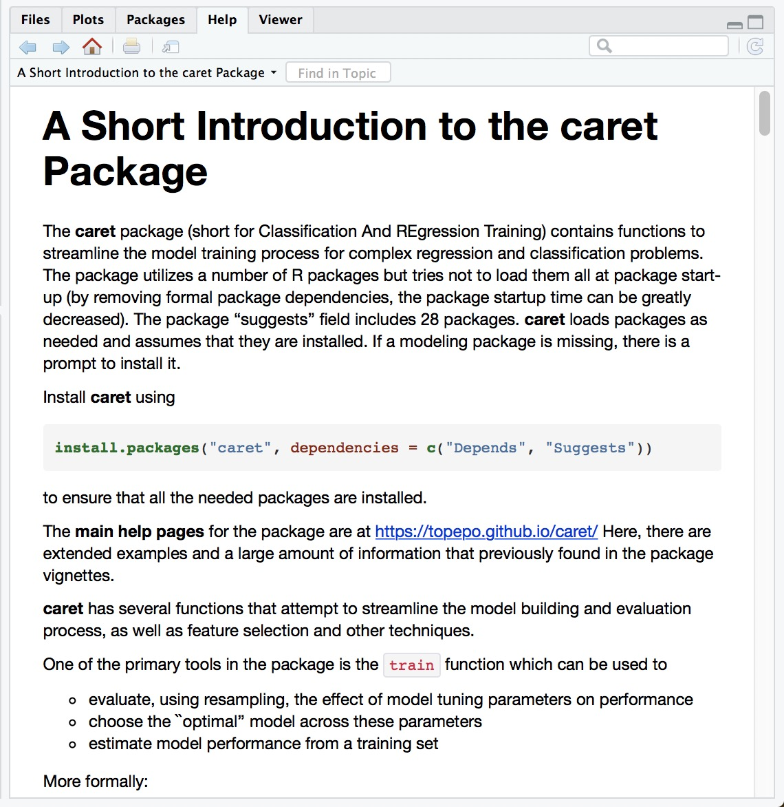
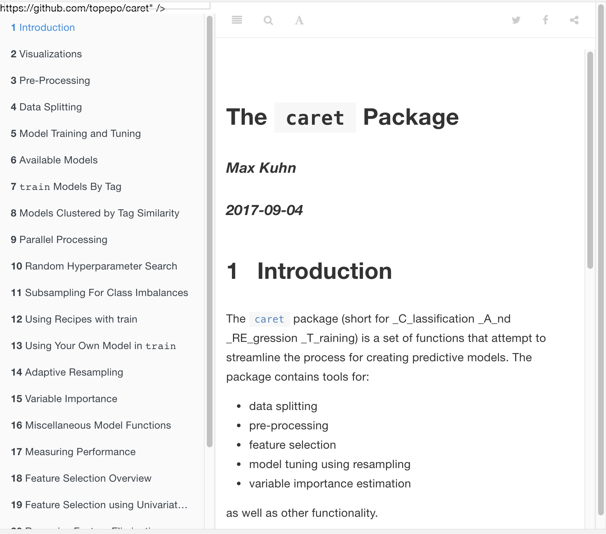

layout: true

<div class="my-footer"><span>
<a href="https://therbootcamp.github.io/"><font color="#7E7E7E">BaselRBootcamp, July 2018</font></a>
&emsp;&emsp;&emsp;&emsp;&emsp;&emsp;&emsp;&emsp;&emsp;&emsp;&emsp;&emsp;&emsp;&emsp;&emsp;&emsp;&emsp;
&emsp;&emsp;&emsp;&emsp;&emsp;&emsp;&emsp;&emsp;
&emsp;&emsp;&emsp;&emsp;&emsp;&emsp;&emsp;&emsp;
&emsp;&emsp;&emsp;&emsp;&emsp;
<a href="https://therbootcamp.github.io/"><font color="#7E7E7E">www.therbootcamp.com</font></a>
</span></div> 

---
  
```{r, eval = FALSE, echo = FALSE}
# Code to knit slides
xaringan::inf_mr('_sessions/D2S2_MachineLearning/MachineLearning.Rmd')
```


```{r setup, include=FALSE}
options(htmltools.dir.version = FALSE)
# see: https://github.com/yihui/xaringan
# install.packages("xaringan")
# see: 
# https://github.com/yihui/xaringan/wiki
# https://github.com/gnab/remark/wiki/Markdown
options(width=110)
options(digits = 4)
library(baselers)

library(tidyverse)
```

# Recap from Machine Learning

---


# What is machine learning?

.pull-left6[


### Algorithms autonomously learning from data.

Given data, an algorithm tunes its *parameters* to match the data, understand how it works, and make predictions for what will occur in the future.

```{r, echo = FALSE, out.width = "80%", fig.align = 'center'}
knitr::include_graphics("https://raw.githubusercontent.com/therbootcamp/therbootcamp.github.io/master/_sessions/_image/mldiagram_A.png")
```

]

.pull-right4[

```{r, echo = FALSE, out.width = "70%", fig.align = 'center'}
knitr::include_graphics("https://raw.githubusercontent.com/therbootcamp/therbootcamp.github.io/master/_sessions/_image/machinelearningcartoon.png")
```


]
---

# What is the basic machine learning process?

```{r, echo = FALSE, out.width = "90%"}
knitr::include_graphics("https://raw.githubusercontent.com/therbootcamp/therbootcamp.github.io/master/_sessions/_image/MLdiagram.png")
```


---

# Why do we separate training from prediction?

.pull-left4[

Just because an algorithm can fit past (training) data well, does *not* necessarily mean that it will *predict* new data well.

Anyone can come up with a model of *past* data (e.g.; stock performance, lottery winnings). Predicting future performance is much more difficult.

> "An economist is an expert who will know tomorrow why the things he predicted yesterday didn't happen today." ~ Evan Esar

]
 
.pull-right6[

```{r, echo = FALSE, out.width = "80%"}
knitr::include_graphics("https://raw.githubusercontent.com/therbootcamp/Erfurt_2018June/master/_sessions/_image/prediction_collage.png")
```

]

---
<br><br>
<font size = 6>Can you come up with a model that will perfectly match past data but is worthless in predicting future data?</font><br><br>


```{r, echo = FALSE}
set.seed(100)
past <- tibble(id = 1:5,
               sex = sample(c("m", "f"), size  = 5, replace = TRUE),
               age = round(rnorm(5, mean = 45, sd = 5), 0),
               fam_history = sample(c("Yes", "No"), size = 5, replace = TRUE),
               smoking = sample(c(TRUE, FALSE), size = 5, replace = TRUE),
               disease = sample(c(0, 1), size = 5, replace = TRUE))

present <- tibble(id = 91:95,
                  sex = sample(c("m", "f"), size  = 5, replace = TRUE),
               age = round(rnorm(5, mean = 45, sd = 5), 0),
               fam_history = sample(c("Yes", "No"), size = 5, replace = TRUE),
               smoking = sample(c(TRUE, FALSE), size = 5, replace = TRUE),
               disease = rep("?", 5))
```

.pull-left45[


### Past "Training" Data
<br>
```{r, results = 'asis', echo = FALSE}
knitr::kable(past, format = "markdown")
```

]


.pull-right45[

### Future "Test" Data
<br>

```{r, echo = FALSE}
knitr::kable(present, format = "markdown")

```

]

---

## Two types of prediction tasks

.pull-left45[

```{r, echo = FALSE, out.width = "100%", fig.align = 'center'}
knitr::include_graphics("https://raw.githubusercontent.com/therbootcamp/therbootcamp.github.io/master/_sessions/_image/classification_task.png")
```

]

.pull-right45[

```{r, echo = FALSE, out.width = "100%", fig.align = 'center'}
knitr::include_graphics("https://raw.githubusercontent.com/therbootcamp/therbootcamp.github.io/master/_sessions/_image/regression_task.png")
```

]

---

## Overfitting

```{r, fig.width = 8, fig.height = 4, echo = FALSE, eval = TRUE, warning = FALSE, out.width = "100%", dpi = 200}
set.seed(5)

N <- 40

iv <- rnorm(N, mean = 10, sd = 2)
truth <- iv 
noise <- rnorm(N, mean = 0, sd = 2)
obs <- truth + noise

data <- data.frame(iv, obs)


poly_pred <- map_dfc(.x = c(1, 19), .f = function(degree) {
  
  output <- data.frame(lm(obs ~ poly(iv, degree), data = data)$fitted.values)
  
  names(output) <- paste0("d", degree)
  
  return(output)

}) %>% mutate(id = 1:N,
              x = iv,
              obs = obs) %>%
  gather(Degree, pred, -id, -x, -obs) %>%
  mutate(`Fitting` = abs(pred - obs))


poly_pred <- poly_pred %>%
  mutate(Degree = case_when(Degree == "d1" ~ "Simple",
                            TRUE ~ "Complex"))


overfit_gg <- ggplot(poly_pred, aes(x = x, y = pred, col = Degree)) + 
  geom_line(size = 1.5) +
  geom_point(aes(x = x, y = obs), col = "black", pch = 21) +
  annotate("segment", x = 5, y = 5, xend = 15, yend = 15, col = "black", linetype = 4, size = 1) +
  xlim(5, 15) +
  ylim(5, 15) +
  labs(title = "Model overfitting",
       subtitle = "Dashed line is TRUE model") +
  theme_bw() +
    theme(legend.position="bottom")
  
poly_pred <- poly_pred %>% mutate(

  obs_new = x + rnorm(1, mean = 0, sd = 2),
  `Prediction` = abs(obs_new - pred)
  
)


poly_pred <- poly_pred %>%
  select(Degree, `Fitting`, `Prediction`) %>%
  gather(phase, Error, -Degree)

agg <- poly_pred %>%
  group_by(Degree, phase) %>%
  summarise(Error = mean(Error))

fit_gg <- ggplot(agg, aes(x = phase, y = Error, fill = Degree)) +
  geom_bar(position = "dodge", stat = "identity") +
  labs(title = "Fitting versus Prediction Error",
       subtitle = "Smaller values are better!",
       x = "Modelling Phase") +  
  scale_y_continuous(limits=c(.75,1.25),oob = scales::rescale_none) +
  theme_bw() +
    theme(legend.position="bottom")

ggpubr::ggarrange(overfit_gg, fit_gg)
```


---

## Optimizing model parameters with cross validation

.pull-left45[

Most machine learning models have two types of parameters, *raw parameters* that dictate how an individual model makes predictions, and *tuning parameters* that determine how those raw parameters are calculated.

|Model| Raw parameters|Tuning parameters|
|:------|:------|:------|
|Decision Trees|Nodes, splits, decisions |Minimum number of cases in each node|
|Regularised regression |Model coefficients | Coefficient penalty term|

To determine 'optimal' tuning parameters, which maximize prediction performance, techniques such as cross validation are often used.

]

.pull-right5[

### Cross Validation

```{r, echo = FALSE, out.width = "80%", fig.align = 'center'}
knitr::include_graphics("https://raw.githubusercontent.com/therbootcamp/Erfurt_2018June/master/_sessions/_image/crossvalidation.jpg")
```

0) Select *tuning parameters*

1) Split the training set into K "folds"

2) Use K - 1 folds for training, and 1 fold for testing.

3) Repeat K times.

4) Average the K testing performances

]


---

.pull-left55[

# Caret

```{r, echo = FALSE, fig.align = 'center', out.width = "30%", eval = FALSE}
knitr::include_graphics("https://vignette.wikia.nocookie.net/joke-battles/images/2/21/Bugs-Bunny-4.png/revision/latest?cb=20151231234917")
```

Caret stands for <b>C</b>lassification <b>A</b>nd <b>RE</b>gression <b>T</b>raining.

`caret` is a 'wrapper' packages that automates much of the the machine learning process.

Do very complex machine learning tasks with a few simple functions

Use any of hundreds of different ML algorithms by changing one "string' (not line!) to use a different model

```{r, eval = FALSE}
library(caret)

train(..., method = "lm") # Regression!
train(..., method = "rf") # Random forests!
train(..., method = "ada") # Boosted trees
```

Knows each model's tuning parameters and chooses the best ones for your data using cross validation (or other method).

]

.pull-right4[
<br><br><br>
```{r, echo = FALSE, fig.align = 'center', out.width = "90%", fig.cap = "The almighty Caret!"}
knitr::include_graphics("https://3qeqpr26caki16dnhd19sv6by6v-wpengine.netdna-ssl.com/wp-content/uploads/2014/09/Caret-package-in-R.png")
```

```{r, echo = FALSE, out.width = "100%", fig.align = 'center'}
knitr::include_graphics("https://upload.wikimedia.org/wikipedia/commons/1/1c/K-fold_cross_validation_EN.jpg")
```


]


---
.pull-left5[

# Caret

```{r, echo = FALSE, message = FALSE}
library(caret)
```


As always, you can install `caret` from CRAN

```{r, eval = FALSE, echo = TRUE}
# Install caret
install.packages("caret")

# Load the caret package
library("caret")
```

Once you've installed `caret`, look at the vignette for a nice overview of the package

```{r, eval = FALSE}
# Open the main package vignette
vignette("caret")
```

Today we will go over the main functions in the package

]

.pull-right45[

### Caret Vignettes

The `caret` package has some of the *best* documentation (vignettes) you'll ever see.

```{r, echo = FALSE, out.width = "90%"}

```

]

---

.pull-left5[
# Caret

Here are the main functions we will cover in the `caret` package

| Function| Purpose|
|--------|----------|
| `createDataPartition()` | Split data into different partitions|
| `trainControl()` | Determine how training (in general) will be done|
| `train()` | Specify a model and find *best* parameters|
| `varImp()` | Determine variable importance |
| `predict()` | Predict values for new data|
| `postResample()` | Evaluate prediction performance|

]

.pull-right45[

### Caret Vignettes

The `caret` package has some of the *best* documentation (vignettes) you'll ever see.

```{r, echo = FALSE, out.width = "90%"}

```

]


---

.pull-left6[
### createDataPartition()

Use `createDataPartition()` to split a dataset into separate partitions.

Useful to split a large dataset into separate training and test data

```{r, warning = FALSE}
data <- baselers %>% 
  drop_na     # Drop missing cases from baselers

# Get training cases
train_v <- createDataPartition(y = data$income, #crit
                               times = 1, 
                               p = .5)$Resample1

# Vector of training cases
train_v[1:10]

# Training Data
baselers_train <- data %>% 
  slice(train_v)

# Testing Data
baselers_test <- data %>% 
  slice(-train_v)
```


]

.pull-right35[

### Training and Test

```{r}
### Training data

dim(baselers_train)

baselers_train %>%
  slice(1:5) %>%
  select(1:3)

### Testing data

dim(baselers_test)

```


]


---
.pull-left55[
### trainControl()

Use `trainControl()` to define how `carat` should select the best parameters for any ML model (that you will specify later with `train()`)

Many methods are available in the `method` argument, look at the help menu with `?trainControl` for additional details

```{r, echo = TRUE, out.width = "90%", eval = TRUE}
# Define how caraet should 
#  select best model parameters

ctrl <- trainControl(method = "repeatedcv",
                     number = 10,  # 10 folds
                     repeats = 2) # Repeat 2 times
```

### trainControl methods

|method|Description|
|:----|:----|
|`"repeatedcv"` | Repeated cross-validation|
|`"LOOCV"`| Leave one out cross-validation|
|`"none"` | Fit one model with default parameters |

]

.pull-right4[
<br><br><br><br>
### Cross Validation
```{r, echo = FALSE, message = FALSE}
library(baselers)
knitr::include_graphics("https://raw.githubusercontent.com/therbootcamp/Erfurt_2018June/master/_sessions/_image/crossvalidation.jpg")
```

]

---

.pull-left55[

### train()

Use `train()` to fit **any** of over 280 models **and** get best parameters

```{r, echo = TRUE, out.width = "90%", eval = TRUE, warning = FALSE}
rpart_train <- train(form = income ~ .,  
                     data = baselers_train,
                     method = "rpart", # Model!
                     trControl = ctrl)
```


|Parameter|Description|
|:-----|:----|
|`form`|Formula specifying criterion|
|`data`|Training data|
|`method`| Model|
|`trControl`| Control parameters|


]

.pull-right4[

See all >280 models on the [Caret Documentation Page](http://topepo.github.io/caret/available-models.html)

```{r, echo = FALSE}

```

]


---

### train()

.pull-left55[

For classification tasks, make sure your criterion is a factor. For regression tasks, make sure it is numeric

```{r, echo = FALSE, message = FALSE}
library(FFTrees)
```

```{r, eval = FALSE}
# Diagnosis is currently coded as 0, 1
heartdisease$diagnosis[1:10]

# Will be a regression model
reg_mod <- train(form = diagnosis ~ .,
             data = heartdisease,
             method = "rpart")
```

<font color='red' size = 3>Warning messages:...</font>

Use `factor()` to convert your criterion to a factor, now you are doing classification!

```{r, eval = FALSE}
# Use factor() to specify a classification model
class_mod <- train(form = factor(diagnosis) ~ .,
                   data = heartdisease,
                   method = "rpart")
```


]

.pull-right4[

[Caret Documentation Page](http://topepo.github.io/caret/available-models.html)

```{r, echo = FALSE}

```

]


---

### train()

Print the result of `train()` to obtain overall results

```{r, echo = TRUE, out.width = "90%", eval = TRUE, warning = FALSE}
rpart_train
```


---
.pull-left4[

### train()

Explore your `train` Object

```{r, echo = TRUE, out.width = "90%", eval = TRUE, warning = FALSE}
# Best tuning parameters
rpart_train$bestTune

# Show the final model
rpart_train$finalModel
```

]


.pull-right55[

```{r, fig.align = 'center'}
# Plot final model
plot(rpart_train$finalModel)
text(rpart_train$finalModel)
```


]

---

.pull-left5[

### varImp()

Use `varImp()` to extract **variable importance** from a model

Result will be be a model-specific method indicaating how important each variable was in predicting the criterion.
    
```{r}
varImp(rpart_train)
```    
    
]

.pull-right45[

```{r, fig.width = 7, fig.height = 4}
# Plot variable importance
plot(varImp(rpart_train))
```

]

---

.pull-left5[
## predict(), postResample()

Test a models prediction performance with `predict()`

```{r}
# Get predictions based on best 
bas_pred <- predict(object = rpart_train, 
                    newdata = baselers_test)

# Result is a vector of predictions 
#   for each row in newdata
bas_pred[1:5]

```

Then summarise overall performance with `postResample()`

```{r}
# Assess performance with postResample()
postResample(pred = bas_pred, 
             obs = baselers_test$income)
```


]

.pull-right45[

### Plot predictions vs Truth

```{r, fig.width = 4, fig.height = 3, fig.align = 'center'}
# Plot predictions versus truth
end <- tibble(pred = bas_pred,
              obs = baselers_test$income)

ggplot(data = end,
       aes(x = pred, y = obs)) + 
  geom_point(alpha = .1) +
  labs(title = "Rpart Performance",
       x = "Predictions",
       y = 'Truth') +
  theme_bw() +
  geom_smooth(method = "lm")
```


]

---
.pull-left5[

## Recap - ML steps with caret

Step 0: Create training and test data (if necessary)

```{r, eval = FALSE}
train_v <- createDataPartition(y, times, p)

data_train <- data %>% slice(train_v)
data_test <- data %>% slice(-train_v)
```

Step 1: Define control parameters

```{r, eval = FALSE}
ctl <- trainControl(method = "repeatedcv",
                    number = 10, 
                    repeats = 2) 
```


Step 2: Train model

```{r, eval = FALSE}
rpart_train <- train(form = income ~ .,  
                     data = data_train,
                     method = "rpart",
                     trControl = ctl)
```

]

.pull-right45[
<br><br><br>
Step 3: Explore

```{r, eval = FALSE}
rpart_train            # Print object
varImp(rpart_train)    # Var importance
rpart_train$finalModel # Final model
```


Step 4: Predict 

```{r, eval = FALSE}
my_pred <- predict(object = rpart_train, 
                   newdata = data_test)
```


Step 4: Evaluate 

```{r, eval = FALSE}
postResample(pred = bas_pred, 
             obs = baselers_test$income)
```


]


---

<br><br>
.pull-left5[

# Caret

There are *many* other great features of caret we haven't touched

- Use the `preProcess()` function to process your data (Imputing (replacing) missing values and transforming predictors)

- Add your own custom model

Be sure to check out the **excellent** documentation site to learn all the details

]

.pull-right45[

### http://topepo.github.io/caret/index.html

```{r, echo = FALSE}

```

]

---

.pull-left4[
<br><br><br><br><br>
# Questions?

## [Machine Learning II Practical](https://therbootcamp.github.io/BaselRBootcamp_2018July/_sessions/MachineLearningII/MachineLearningII_practical.html)


]

.pull-right55[
<br><br><br>
```{r, echo = FALSE, out.width = "90%", fig.cap="<font size = 4>Source: www.petsmagazine.com</font>"}
knitr::include_graphics("https://www.petsmagazine.com.sg/img/articles/main/bugsbunny.jpg")
```

]

