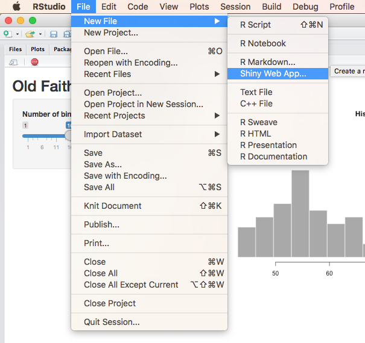
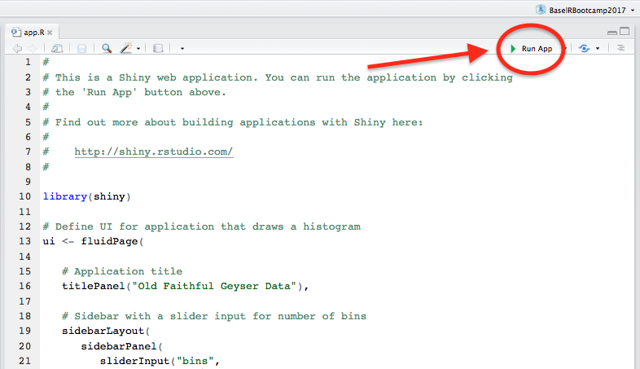
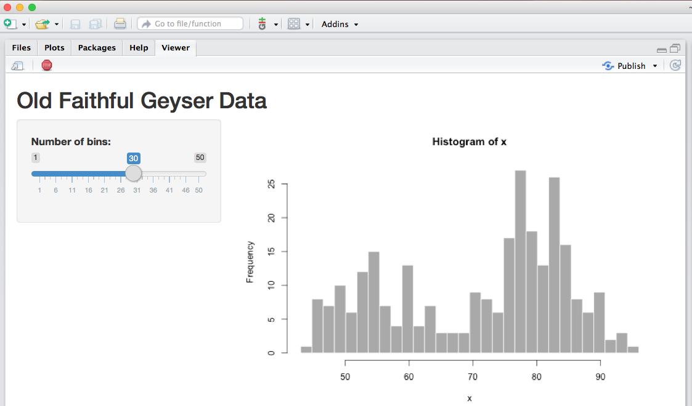

```{r setup, echo = FALSE}
knitr::opts_chunk$set(comment = NA, 
                      fig.width = 6, 
                      fig.height = 6,
                      fig.align = 'center',
                      echo = FALSE, 
                      eval = FALSE, 
                      warning = FALSE)

options(digits = 3)
```


<figure>
<center>
  
</figure>


## {.tabset}

### Overview

In this practical you'll practice creating interactive graphics with `shiny`.

By the end of this practical, you'll try to create the following app:

<iframe src="https://econpsychbasel.shinyapps.io/FinalApp/" width="800" height="600"></iframe>

### Datasets

|File  |Rows | Columns |
|:----|:-----|:------|
|[baselers.csv](https://raw.githubusercontent.com/therbootcamp/BaselRBootcamp_2018July/master/_sessions/_data/complete/baselers.csv)| 260 | 24 |
|[kc_house.csv](https://raw.githubusercontent.com/therbootcamp/BaselRBootcamp_2018July/master/_sessions/_data//baselrbootcamp_data/kc_house.csv) | 21613 | 21|House sale prices for King County between May 2014 and May 2015. |

### Packages

|Package| Installation|
|:------|:------|
|`tidyverse`|`install.packages("tidyverse")`|
|`DT`|`install.packages("DT")`|

### Cheatsheet

<figure>
<center>
<a href="http://shiny.rstudio.com/images/shiny-cheatsheet.pdf">
  
  <figcaption>http://shiny.rstudio.com/images/shiny-cheatsheet.pdf</figcaption></a>
</figure>


# Tasks


### A - Getting setup

1. Open your `baselrbootcamp` R project. 

2. Create a new folder in your project called `5_Shiny`.

3. Inside of your `5_Shiny` folder, create a *new* folder called `1_Data` (not the one you had previously)

4. In your computer browser, copy and paste the `baselers.csv` file into your *new* `1_Data` folder.

5. In RStudio, click File -- New File -- Shiny Web App

```{r, echo = FALSE, fig.align = 'center', eval = TRUE, out.width = "60%"}

```

6. Save the app under the name "Shiny_Baselers" in your `5_Shiny` folder:

```{r, echo = FALSE, fig.align = 'center', eval = TRUE, out.width = "60%"}
knitr::include_graphics("https://github.com/therbootcamp/therbootcamp.github.io/blob/master/_sessions/_image/Shiny_NewApp_ss.jpg?raw=true")
```

7. A new file called `app.R` should now be open! Click the "Run App" button to open the app.

```{r, echo = FALSE, fig.align = 'center', eval = TRUE, out.width = "60%"}

```

8. Your app should now be up in a new window! Play around with the Number of Bins slider to see its effect on the plot

```{r, echo = FALSE, fig.align = 'center', eval = TRUE, out.width = "60%"}

```


### B - Staring with a new template

1. We have a new app template we'd like you to use. You can find it at this link: [Shiny Template - app.R](https://raw.githubusercontent.com/therbootcamp/BaselRBootcamp_2018July/master/_sessions/Shiny/ShinyTemplate/app.R). Open this link and copy *all* of the code it contains. Then, go back to your `app.R` file and delete *all* of the content in the file. After, paste all of the code you just copied.

2. Click the "Run App" button to run the app! You should now see the following app

```{r, echo = FALSE, out.width = "70%", eval = TRUE}
knitr::include_graphics("https://github.com/therbootcamp/therbootcamp.github.io/blob/master/_sessions/_image/Shiny_AppTemplate.jpg?raw=true")
```

3. Play around with the inputs in the app and click in the different tabs. What content can you change?

### C - Add a subtitle

1. Now it's time to add a new widget to the user interface! After the existing `textInput(inputID = "Title, ...)` code, add a singe comma (like you see below). Then, just below that in the section where you see `# Add subtitle`, add the following code:

```{r, echo = TRUE, eval = FALSE}

textInput(inputId = "title",
          label = "Title",
          value = "Plot Title"),   # Add the comma here!!!
      
# Add subtitle

textInput(inputId = "subtitle",
              label = "Subtitle",
              value = "")
```

2. Run your app! If you get an error, ask for help! 

3. Do you see the new text input field? Play around with the input. Do you see any changes to the plot? I predict you won't!

4. Don't worry we'll fix it! We need to change the plotting code to recognize our new `input$subtitle` input. In the `ggplot()` code in the server section, change `subtitle = "subtitle"` to `subtitle = input$subtitle` like you see below.

```{r, echo = TRUE, eval = FALSE}
labs(title = input$title,
         subtitle = "subtitle",   # Change to: input$subtitle
         x = "age",
         y = "income",
         caption = "My Caption")
```

5. Run your app and play around! Does your new subtitle field work now? It should!

### D - Add a caption

1. Now it's time to add a caption! Using the same logic as above, add a new text input with `inputID = "caption"` to your user interface. Use the template below for help!

```{r, eval = FALSE, echo = TRUE}
# Add caption
textInput(inputId = "caption",
          label = "Caption",
          value = "")
```

2. Update your `ggplot()` code so that `caption = input$caption` like below:

```{r, echo = TRUE, eval = FALSE}
labs(title = input$title,
         subtitle = input$subtitle, 
         x = "age",
         y = "income",
         caption = "caption")   # Change to: input$caption
```

3. Run your app! Does the new caption text widget work?

### E - Add x and y aesthetics

1. Now it's time to control which variables are mapped to the x and y aesthetics. To do this, first add the following two new `selectInput()` widgets to the user interface (below your 'caption' input)

```{r, eval = FALSE, echo = TRUE}
# Add this to your ui code!!      

# Add x

selectInput(inputId = "x",
            label = "x",
            choices = names(data)),

# Add y

selectInput(inputId = "y",
            label = "y",
            choices = names(data))
```

2. Now it's time to change the `ggplot` code so that it sees your new widgets. Replace the exising values of `"age"` and `"income"` with `input$x` and `input$y` as follows:

```{r, eval = FALSE, echo = TRUE}
 p <- ggplot(data = data,
                aes_string(x = "age",      # Change to: input$x
                           y = "income"))  # Change to: input$y
```

3. Run your app! Play around! You should now be able to select your x and y aesthetics!

### F - Add color

1. Time to allow the user to color the points of the plot. To do this, include a new `selectInput()` as follows:

```{r, eval = FALSE, echo = TRUE}
# Add color

selectInput(inputId = "color",
              label = "Point colors",
              choices = colors(),
              selected = "black"),
```

2. In your `ggplot` code, change `col = "black"` to `col = input$color`

```{r, eval = FALSE, echo = TRUE}
p <- ggplot(data = data,
              aes_string(x = input$x, 
                         y = input$y)) + 
    geom_point(alpha = 1, 
               col = "black",     # Change to: input$color
               size = input$size)
```

3. Run your app! Can you now change the colors of your points?

### G - Add alpha

1. Using the same logic as above, add a new `sliderInput()` to the user interface that allows the user to control the `alpha` level of the points using the following code:

```{r, eval = FALSE, echo = TRUE}
# Add alpha sliderInput to user interface

sliderInput(inputId = "alpha",
            lable = "alpha",
            min = 0,
            max = 1,
            value = 1)
```

2. In your `ggplot()` server code, replace `alpha = 1` with `alpha = input$alpha`

```{r, eval = FALSE, echo = TRUE}
geom_point(alpha = 1,             # Change to: input$alpha 
           col = input$color,
           size = input$size) +
```

3. Run your app! Can you now control the alpha (transparency) of the points?

### H - Add regression line

1. Now we'll add a checkbox that allows the user to add a regression line to the plot. First, add the following `checkboxInput()` to the user interface:

```{r, eval = FALSE, echo = TRUE}
# Add smooth

checkboxInput(inputId = "smooth",
              label = "Add Regression line?",
              value = FALSE)
```


2. Next add the following code *below* the `ggplot()` code. This will add `geom_smooth()` to the existing plotting object `p`

```{r, eval = FALSE, echo = TRUE}
# ggplot() code above...

# ADD smooth
    
# --------------------------

if(input$smooth) {
  
  p <- p + geom_smooth(method = "lm")
  
}

# ---------------------------

# Return the plotting object!

print(p)

```


3. Re run your app! Can you now add a regression line to your plot?


### I - Add a download plot button

1. Let's add a button to download your plot! Start by adding the following `downloadButton()` input to the user interface.

```{r, echo = TRUE, eval = FALSE}
# Add downloadPlot

downloadButton(outputId = "downloadPlot",
               label = "Download Plot!")
```

2. In the server code, add the following code to tell the download button what to do!

```{r, echo = TRUE, eval = FALSE}
# Add output$downloadPlot!

output$downloadPlot <- downloadHandler(
  filename = "myplot.png",
  content = function(file) {
    ggsave(file, plot = my_plot(), device = "png")
  }
)
  
```


3. Run your app! Play around and try your new download button. Did it work!

### J - Add a table tab

1. Now it's time to add our nice HTML table to your `Data` tab. Replace the current value `tabPanel("Data")` with the following:

```{r, eval = FALSE, echo = FALSE}
# Table tab
tabPanel("Data", br(), dataTableOutput("table"))   # Add this!!!
```


2. In your server code, add the following block of code. This will send your rendered data table to the user interface.

```{r, echo = TRUE, eval = FALSE}
# Generate a summary of the data ----
output$table <- renderDT({
  
  datatable(data %>%
              select(1:8))
  
})
```

3. Run your app! Do you see your new table!


